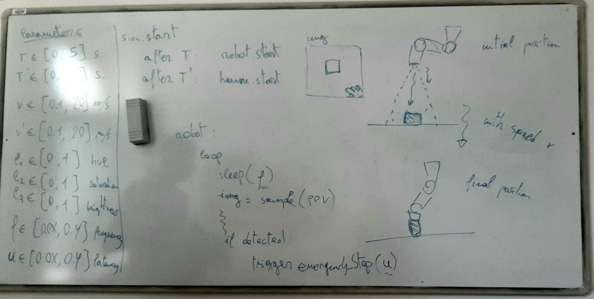

# SToCAIS
This project explores the safety space of a collaborative AI system (CAIS). The main simulation is cais\_scenario.ttt and the control scripts are named cais\_zmq\_\[AlgoCode].py. 

The remote api used in the project is zmq (available [here](https://www.coppeliarobotics.com/helpFiles/en/zmqRemoteApiOverview.htm)) and must be installed to run the project. The api allows us to interact with the simulation from an external script. 

## Requirement
To run this project, you need to have CoppeliaSim installed. To download, go to [link](https://www.coppeliarobotics.com/downloads). In our work, we used the Edu variant, Version 4.2.0 (rev. 6). 
To run this example, you need:
- CoppeliaSim 4.2.0 or newer 
- Python >= 3

Our simulation was developed on Ubuntu 20.04, 64-bit system with Python 3.8.10 installed.

### Running the simulation
Once the simulator package is downloaded, unzip the file then go into the created folder (it may help to rename the created folder to something simpler like CoppeliaSim). On Linux, the simulator can be run with _./coppeliaSim.sh_ on the terminal. 

With the simulator running, one can load the scene named "cais_scenario.ttt" into the simulator "File -> Open Scene". 

Also, to run the python script, it is advised to have the cais\_zmq.py script in the folder with the path _"~/CoppeliaSim/programming/zmqRemoteApi/clients/python"_.

## Parameters and Scenario

